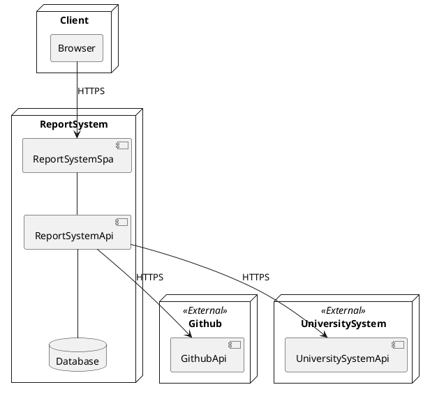

# Система управления отчетами

В рамках практики планируется разработка ИС для автоматизации процесса сдачи лабораторных работ, минимизация действий пользователя в данном процессе. Назначение системы:
- Автоматизация процесса принятия работ в рамках учебного процесса
- Автоматизация процесса написания отчета о выполнении работ

### Цель задания
разработать сервис, который предоставляет функционал для добавления информации о лабораторных работах, загрузка решений, их оценивание и генерация отчетов. Также для этой системы планируется реализовать пользовательский веб-интерфейс. Технологии:
- C#/.NET
- Бекенд - ASP.NET
- Фронтенд - .Blazor
- SQL Server + Entity Framework

### Требования к характеристикам взаимосвязей создаваемой системы со смежными системами, требования к ее совместимости, в том числе указания о способах обмена информацией

Система должна быть интегрирована с остальными системами через предоставленный API используя http запросы.

При интеграции с системой университета:
- Будет происходить авторизация пользователей
- Будут запрашиваться данные о группах, студентах
- Будут отправляться данные о баллах

При интеграции с Github
- Будет происходить авторизация пользователей
- Будут запрашиваться исходные коды, которые загружены и предоставлены на проверку

### Требования к защите информации от несанкционированного доступа

Средства защиты, обеспечиваемые создаваемым программным продуктом:
1. Требование по наличию пароля для пользователей, особенно для пользователей с ролью администратора.
2. Реализация ролевой модели доступа.
3. Обеспечение регистрации событий и действий пользователей.

### Возможные задачи

- Изучение системы управления пользователями ASP.NET Core Identity
  - Изучение предоставляемого функционала
  - Использование Identity для реализации авторизации в проекте
  - Разграничение доступа в фронтенд и бекенд частях проекта с использование identity, ролевая модель доступа
- Средства обеспечения качества ПО
  - Формализация сценариев работы
  - Написание тестов разного уровня - функциональные, интеграционные
  - Применение Postman - как инструмент автотестирования API
- Генерация отчетов по репозиториям
  - Интеграция с API Github для получения исходного кода, access tokens, разграничение доступа
  - Использование инструментов работы с docx/pdf для генерации отчетов
  - Интеграция с API OneDrive/Google Drive для автоматической публикации сгенерированных документов
- Возможно про автопроверку
- Разработка функционала:
  - Одна из частей проектов:
    - Модуль управления студентами - добавление, изменение, поиск студентов, групп
    - Модуль управления предметами - добавление, изменение, поиск предметов, преподавателей
    - Модуль управления заданиями - добавление, изменение, поиск
    - Модуль управления решениями - добавление, изменение, поиск
    - Модуль оценивания работ - добавления оценок, фидбека, синхронизация оценивания с Google Drive
  - описание модели хранения данных
  - реализация бизнес-логики системы
  - написание API и клиента к ним
  - разработка Web UI с использованием Blazor

### Формат работ

- Ведение проекта (хранение кода, таск трекинг) на платформе Github
- Недельные спринты с отчетами
- Планинги в начале недели, демо в конце недели
